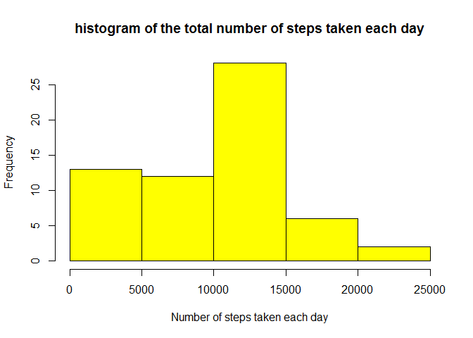
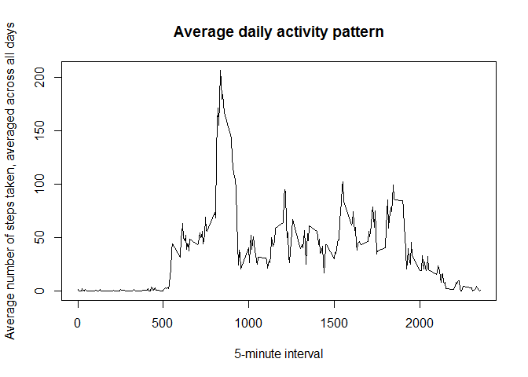
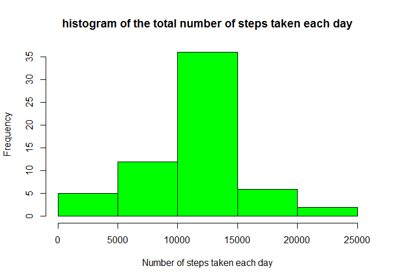
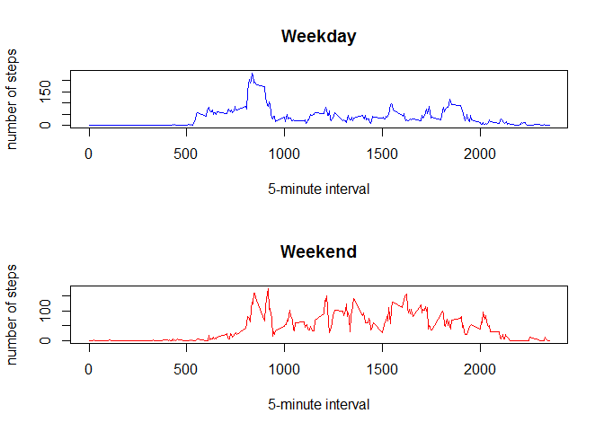

# Reproducible Research: Peer Assessment 1


## Loading and preprocessing the data
unzip activity.zip folder if the activity.csv file is not in the working directory

```r
if (!file.exists("activity.csv")){
        unzip("activity.zip")
}
```


read the activity.csv file into a variable

```r
load_data <- read.csv("activity.csv")
```


transform the date column to Date class

```r
tdata <- transform(load_data, date = as.Date(date))
```


## What is mean total number of steps taken per day?
the total number of steps taken per day is:

```r
daily_total <- sapply(split(tdata$steps, tdata$date), sum, na.rm = TRUE)
```


histogram of the total number of steps for each day

```r
hist(daily_total, main = "histogram of the total number of steps taken each day", xlab ="Number of steps taken each day", col = "yellow")
```




mean number of steps taken each day

```r
mean(daily_total)
```

```
## [1] 9354.23
```


median of the total number os steps for each day

```r
median(daily_total)
```

```
## [1] 10395
```


## What is the average daily activity pattern?
average steps for each 5-minute interval across all days

```r
average_of_interval <- sapply(split(tdata$steps, tdata$interval), mean, na.rm = TRUE)
```


time series plot of 5-minute interval and average number of steps across all days

```r
plot(names(average_of_interval), average_of_interval, main = "Average daily activity pattern", xlab ="5-minute interval", ylab = "Average number of steps taken, averaged across all days", type ="l")
```




5-minute interval with the maximum average steps across all days

```r
average_of_interval[average_of_interval == max(average_of_interval)]
```

```
##      835 
## 206.1698
```


## Imputing missing values
total number of missing values for steps field is

```r
length(tdata[!(complete.cases(tdata)),1])
```

```
## [1] 2304
```


Strategy: missing values will be filled with the mean for the corresponding 5-minute interval in a new dataset


a new dataset equal to the original dataset is created

```r
new_data <- tdata
```
 
 
each NA value for the steps field is filled with the value for the corresponding average for 5-minute interval

```r
for(i in 1:length(new_data$step)){
        if(is.na(new_data[i, 1])){
                k = as.character(new_data[i, 3])
                new_data[i,1] = average_of_interval[k]
        } 
 }
```


a histogram of the total number of steps for each day for the new dataset

```r
daily_total_new <- sapply(split(new_data$steps, new_data$date), sum, na.rm = TRUE)

hist(daily_total_new, main = "histogram of the total number of steps taken each day", xlab ="Number of steps taken each day", col = "green")
```




mean number of steps taken each day for new dataset

```r
mean(daily_total_new)
```

```
## [1] 10766.19
```


median of the total number os steps for each day

```r
median(daily_total_new)
```

```
## [1] 10766.19
```


these values differ from the estimates from the first part of the assignment

imputing missing data on the estimates of the total daily number of steps makes the mean and median equal. Both the mean and the median also increased


## Are there differences in activity patterns between weekdays and weekends?
day are classified as Weekday or Weekend in the day_factor field

```r
for(i in 1:length(tdata[,1])){
        if(weekdays(tdata$date[i]) == "Sunday" | weekdays(tdata$date[i]) == "Saturday"){
                tdata$day_factor[i] = "Weekend"
        } else {
                tdata$day_factor[i] = "Weekday"
        }
}
```


the day_factor field is transformed to factor

```r
new_tdata <- transform(tdata, day_factor = as.factor(day_factor))
```


subset all the weekday data

```r
weekday_data <- subset(new_tdata, new_tdata$day_factor == "Weekday")
```


subset all the weekend data

```r
weekend_data <- subset(new_tdata, new_tdata$day_factor == "Weekend")  
```


average steps for each 5-minute interval across all weekdays

```r
average_of_interval_weekday <- sapply(split(weekday_data$steps, weekday_data$interval), mean, na.rm = TRUE)
```

average steps for each 5-minute interval across all weekends

```r
average_of_interval_weekend <- sapply(split(weekend_data$steps, weekend_data$interval), mean, na.rm = TRUE)
```


time series plot of 5-minute interval and average number of steps across all weekdays and weekends

```r
par(mfrow = c(2, 1))
plot(names(average_of_interval_weekday), average_of_interval_weekday, main = "Weekday", ylab = "number of steps", xlab = "5-minute interval", type ="l", col = "blue")


plot(names(average_of_interval_weekend), average_of_interval_weekend, main = "Weekend", ylab = "number of steps", xlab = "5-minute interval", type ="l", col = "red")
```




Sinece the two plots are not thesame, there are differences in activity pattern between weekdays and weekends
